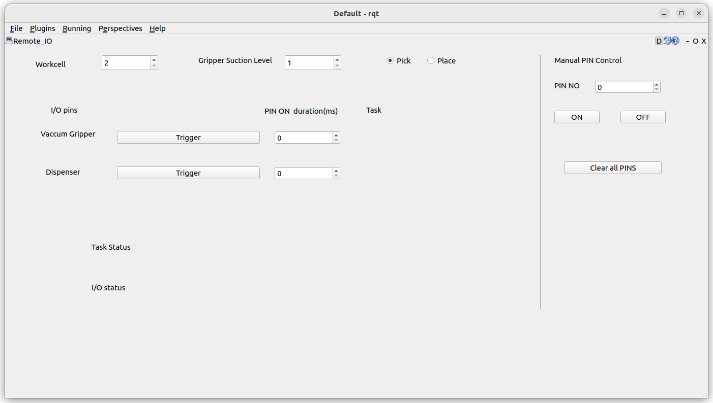

# Remote I/O Rqt plugin
Remote IO plugin package for controlling automation system

# Installation

Cloning the package into a ROS 2 workspace
```
mkdir -p ~/remote_io_ws/src
cd ~/remote_io_ws/src
git clone https://github.com/lentin-tcs/remote_io_plugin
cd ..
rosdep install --from-paths src --ignore-src --rosdistro humble -y
sudo apt install pluginlib-dev
colcon build
echo "source ~/remote_io_ws/install/setup.bash" >> ~/.bashrc
bash
```


# Running the plugin
-----------------------
Start the [ethercat ros 2 driver and igh master as per this repository](https://github.com/ros2torial/ros2_ethercat)

Run rqt and load the Remote IO plugin from the plugins-> Remote IO
```
rqt --force-discover
```
# Screenshot


